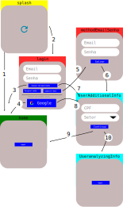

# Criando o projeto
flutter create --project-name=todo_getx_isar --org education.brintec --platforms android,web -a kotlin ./todo_getx_isar

# Estrutura
View - ViewModel - Model

Analise e adaptação destes textos:
* http://kyubid.com/blog/mvvm-android-tutorial-01-mvc-vs-mvp-vs-mvvm/
* https://pub.dev/packages/flutter_clean_architecture
* https://medium.com/@ajliberatore/android-clean-architecture-mvvm-4df18933fa9

# Authentication
O Fluxo de autenticação segue esta abordagem:
1. Usuário acessa ao aplicativo e **splash.page** analisa sua situação. Se estiver logado vai para **home.page**.
2. Usuário acessa ao aplicativo e **splash.page** analisa sua situação. Se não estiver logado vai para **login.page**.
3. Usuário informa email/senha e se cadastrado e informações adicionais regularizadas e vai para **home.page**.
4. Usuário informa provedor de acesso e se cadastrado e informações adicionais regularizadas vai para **home.page**.
5. Se solicitar cadastrar email/senha para acesso vai para **methodEmailSenha.page**.
6. Após informar email/senha para cadastro se existir informações adicionais segue para **UserAdditionalInfo.page**.
7. Usuário informa email/senha e se cadastrado e informações adicionais irregulares vai para **UserAdditionalInfo.page**.
8. Usuário informa provedor de acesso e se cadastrado e informações adicionais irregulares vai para **UserAdditionalInfo.page**.
9. Registrada as informações adicionais se não houver analise vai para **home.page**.
10. Registrada as informações adicionais se houver analise vai para **UserAnalyzingInfo.page**. E espera-se liberação dos administradores do app. 

